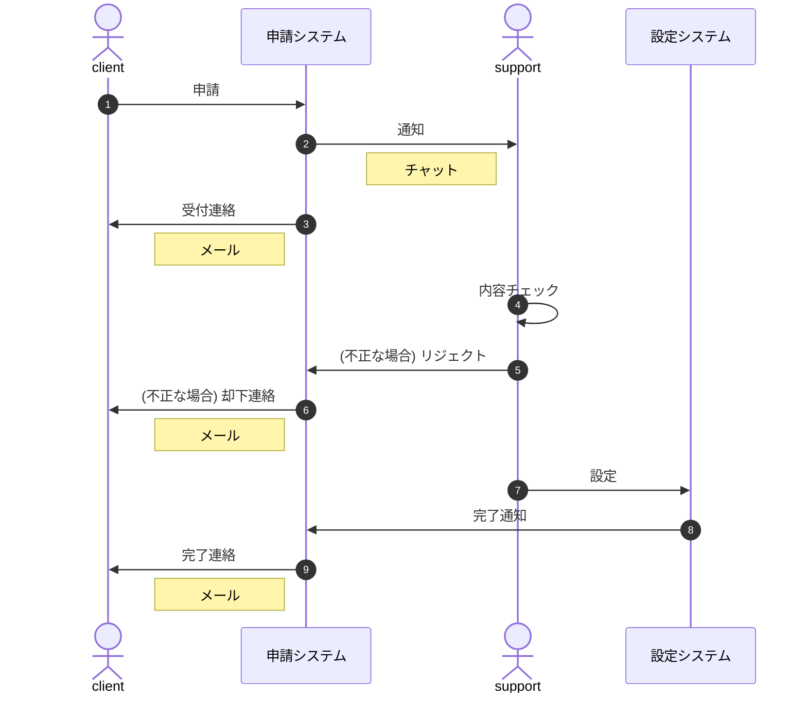

> **Note** note
> note

> **Warning** Warn
> Warn

> :information_source: info
> info

> :warning: warning
> warning 

---

* https://github.blog/2022-05-19-math-support-in-markdown/

$$ F = G \frac{M m}{r^2}  $$


# 111

https://help.github.com/articles/about-readmes/

 * [google JP][]
   * [test][google COM]
   - [google COM][]
 - [github](https://github.com/)
   * [image cat][]
   ### xxx
   + aaa
     - bbbbb

 ---

 - [ ] 未完了タスク 1
 - [x] 完了タスク 1
 - [ ] 未完了タスク 2
 - [x] 完了タスク 2

 ---

![image avatar][]

 * [local link](etc/AAAA.md)

## 22222

<details>
<summary>details summary 構文</summary>

https://developer.mozilla.org/ja/docs/Web/HTML/Element/details

 * ![image avatar][]

```sh
$ sudo -i
# whoami
# who am i
```
---
```sh
$ date
```
![image cat][]

</details>

---

[google JP]: https://www.google.co.jp/ "google.co.jp"
[google COM]: https://www.google.com/ "google.com"
[image cat]: etc/20150515204011_p.jpg "猫"
[image avatar]: https://avatars2.githubusercontent.com/u/1390541?s=100&v=4 "avatar"

---

## Mermaid


